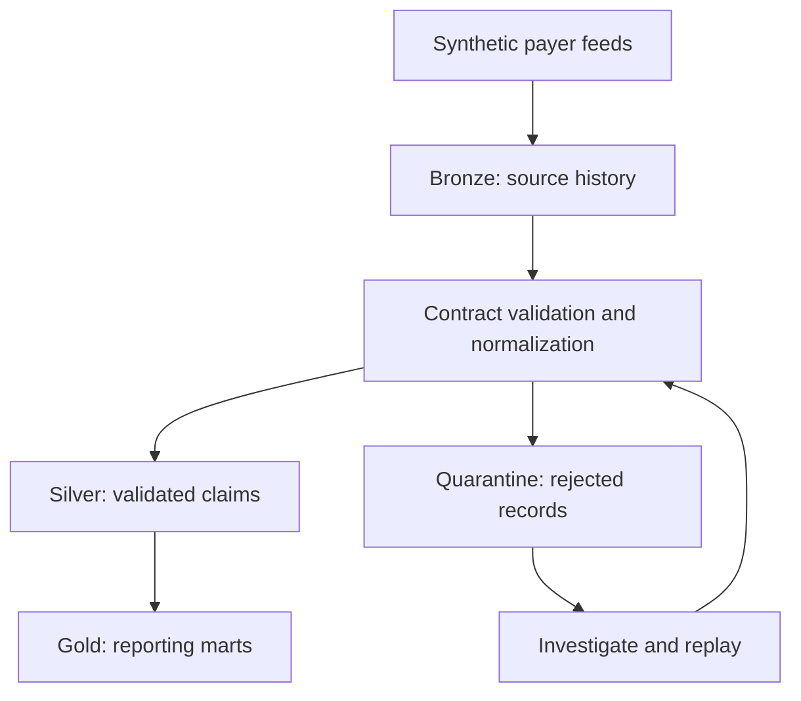

# Healthcare Claims Lakehouse

A multi-payer data engineering project focused on trustworthy claims reporting, incremental processing, and recovery from data and pipeline failures.

> Status: Architecture and implementation planning. Pipeline capabilities below are planned and will be marked complete only after verification.

## Business Problem

Healthcare payers deliver claims with different schemas, inconsistent identifiers, duplicate submissions, and delayed corrections. Loading these records directly into reporting can distort claim counts, payment totals, and denial rates.

This project will standardize those feeds into a common claims model while preserving source history, isolating invalid records, and making reporting results traceable.

## Planned Architecture

Airflow will orchestrate processing. PySpark and Delta Lake will provide transformation and table storage. Tests, reconciliation checks, and run metrics will verify pipeline behavior.

## Engineering Scope

### 1. Multi-payer ingestion
- Generate reproducible synthetic claims for three fictional payers.
- Support different CSV and JSON source layouts.
- Track source file, payer, batch identifier, ingestion time, and content checksum.
- Preserve original inputs for investigation and replay.

### 2. Data contracts and quality
- Define required fields, data types, and accepted values.
- Detect incompatible schema changes before publishing downstream data.
- Validate claim-line identifiers, dates, amounts, and reference relationships.
- Quarantine rejected records with explicit failure reasons.

### 3. Incremental processing
- Identify claims using payer-scoped claim and line keys.
- Distinguish exact duplicates from legitimate corrections.
- Apply newer source versions without allowing stale updates to overwrite them.
- Verify that rerunning the same batch does not change business totals.

### 4. Reconciliation and reporting
- Account for accepted, rejected, duplicate, and superseded records.
- Reconcile financial amounts using documented rules for each processing stage.
- Build reporting marts for payments, denials, and processing lag.
- Document table grain and metric definitions to prevent double counting.

### 5. Reliability and observability
- Record batch outcomes, quality failures, freshness, and execution duration.
- Test recovery after an interrupted run.
- Support controlled backfills and replay.
- Trace reporting records to their source batch and transformation version.

## Planned Technology Stack

| Component | Technology | Purpose |
|---|---|---|
| Processing | Python, PySpark | Ingestion and transformations |
| Table storage | Delta Lake | Transactional tables and incremental merges |
| Orchestration | Apache Airflow | Dependencies, retries, and backfills |
| Local environment | Docker Compose | Reproducible execution |
| Testing | pytest, Spark integration tests | Business rules and pipeline behavior |
| Continuous integration | GitHub Actions | Automated validation |
| Reporting | SQL | Documented analytical models |

The first working implementation will run locally. Cloud deployment is a later extension.

## Verification Scenarios

The demonstration will include:

- Replaying a previously processed file.
- Receiving the same claim identifier from different payers.
- Applying a correction followed by an older version.
- Rejecting malformed records while retaining actionable error details.
- Detecting a breaking source-schema change.
- Recovering from an interrupted batch.
- Rebuilding a reporting period from retained source history.

Each scenario will include an expected outcome and an automated check where practical.

## Delivery Milestones

- [ ] v0.1 — Repository foundation, architecture decisions, and source contracts
- [ ] v0.2 — Synthetic payer feeds and Bronze ingestion
- [ ] v0.3 — Silver normalization, validation, and quarantine
- [ ] v0.4 — Incremental merges, correction handling, and replay tests
- [ ] v0.5 — Gold reporting marts and reconciliation
- [ ] v0.6 — Airflow orchestration, run metrics, and recovery scenarios
- [ ] v1.0 — Reproducible demo, measured benchmarks, and release documentation

## Evidence and Measurements

Published results will include the dataset size, execution environment, commands, and observed outcomes. Performance and reliability claims will be added only after measurement.

Architecture decisions will explain trade-offs, limitations, and alternatives.

## Data Boundaries

This repository will use synthetic data only. It will not contain patient records, employer data, credentials, or proprietary payer files.

The initial contracts are simplified portfolio formats. They do not implement full X12 EDI or FHIR conformance. This project does not claim HIPAA certification or production deployment.
